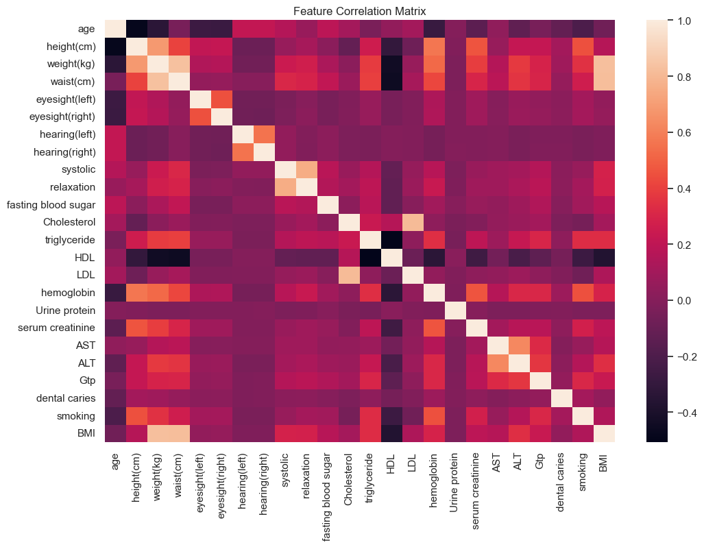
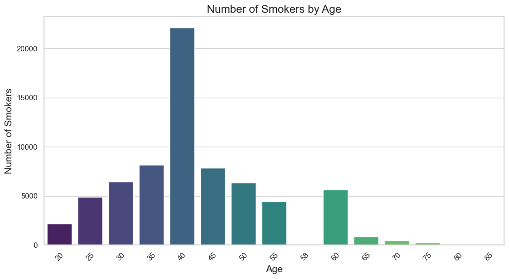
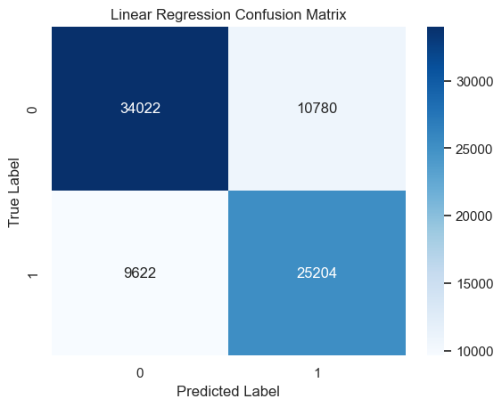
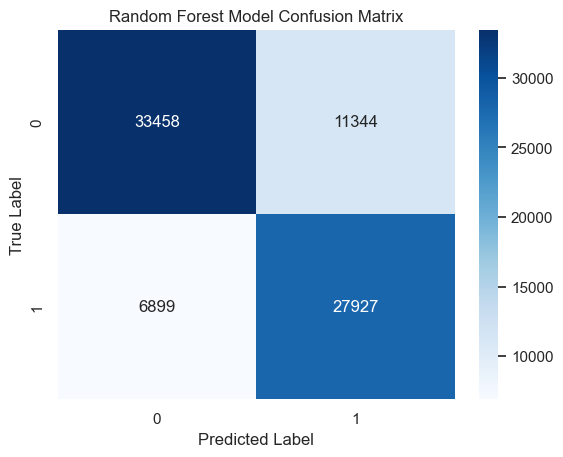

# BREATHE AGAIN

## Project Overview
This is a classification problem, whose main aim is to classify whether or not someone is a smoker using bio-signals. The project will focus on the main tell signs that someone is a smoker and recommend measures to promote the cessation of smoking.

## Business Understanding 

Victorious Living is a non profit Christian organization which is in the business of helping as many people as possible find abundant life in Christ and live Victoriously! As Jesus said in John 10 : 10 ,"The thief does not come except to kill, to steal and to destroy, but I have come that they may have life and that they may have it more abundantly. Too many people are stuck in the menace of smoking,and many die as a result of the diseases caused by smoking.From this project, Victorious Living aims to identify the major health risks that are brought about by smoking and thereafter use this data to sensitize people against smoking in the hope that more people will be able to breathe again and live Victorious Lives in Christ.

### Objectives
1. Identify the effects of smoking on the body systems.  

2. Identify the distribution of smokers by age.

3. Identify the best classification model to use for accurately predicting the smoking status of an individual based on bio-signals.

## Data Understanding

A Smoker Status Dataset has been used for this project. It has over 159,000 rows and 23 Feature columns, which are the Bio-Signals. The target variable of the dataset is 'smoker status'.

As can be seen above, we have over 159,000 rows with 23 features columns and 1 target column. 
- `id` : Id of the current row.
- `age`: How old the individual is.
- `height`: Height in centimeters.
- `weight`: Weight in kilograms.
- `waist(cm)`: Waist circumference in centimeters.
- `eyesight(left)`: Eyesight in diopters(D).
- `eyesight(left)`: Eyesight in diopters(D).
- `hearing(left)` : 1 for normal hearing/2 for hearing imparment.
- `hearing(right)` : 1 for normal hearing/2 for hearing imparment.
- `systolic` : blood pressure in mmhg(millimeters of mercury). 90-120 (Normal range)
- `relaxation` : blood pressure in mmhg(millimeters of mercury).
- `fasting blood sugar` 
- `Cholesterol` : total
- `triglyceride` : 
- `HDL`: High Density Liprotein (cholesterol type)
- `LDL` : Low Denstity Lipoprotein (cholesterol type)
- `hemoglobin` :
- `Urine protein` 
- `serum creatinine`:
- `AST` : aspartate aminotransferase
- `ALT` : alanine aminotransferase
- `Gtp` 
- `dental carries` 
- `smoking` : 0 for non-smokers / 1 for smokers

Below is a pie chart to visualize the difference in the distribution of Smokers and Non-Smokers.

## Correlation Matrix of Bio Status

- Cholesterol and LDL(Low-Density Lipoprotein aka bad cholesterol) are highly correlated.

## Bar Graph of Distribution of Smokers by age

- The largest population of smokers are in their 40's.
  More on this in the research findings section below

## Confusion Matrix from Logistic Regression and Random Forest Classifiers

##### Accuracy Score: 0.74

##### Accuracy Score: 0.7709

- The Random Forest Classifier does a better job at predicting the smoking status of an individual when it is fed with bio-status data compared to Logistic Regression Classifier.

## Research Findings

  Smoking is closely linked to elevated levels of bad cholesterol (LDL). When one smokes, it triggers a series of biochemical processes that negatively affect cholesterol levels and cardiovascular health.

 Below are some effects of smoking to the body. 
 1. Oxidative Stress: Smoking increases oxidative stress which damages the walls of blood vessels. The damage encourages the accumulation of LDL cholesterol on the arterial walls, contributing to an increased risk of
 LDL buildup. 

 2. Decrease in HDL Cholesterol: Smoking reduces levels of high-density lipoprotein(HDL) also known as "good" cholesterol. HDL helps remove LDL from the bloodstream, so lower  HDL levels lead to an increased risk of LDL buildup. 

 3. Impaired Lipid Metabolism: Smoking affects how the body metabolizes fats, leading to an increase in the levels of triglycerides, another type of fat that contributes to heart disease. This can in turn lead to an increase in LDL Cholesterol levels.

 4. Inflammation: Smoking causes inflammation which makes LDL cholesterol more likely to become oxidized - a form that is a particularly harmful and more likely to contribute to atherosclerosis, a condition characterised by hardened and narrowed arteries. 

 > U.S. Department of Health and Human Services. (2020). Smoking and Cardiovascular Disease: A Report of the Surgeon General. Washington, DC: U.S. Government Printing Office. Available at [[https://www.cdc.gov/tobacco/data_statistics/sgr/2020-smoking-cardiovascular-disease/index.html.](https://stacks.cdc.gov/view/cdc/84557/cdc_84557_DS1.pdf)](https://stacks.cdc.gov/view/cdc/84557/cdc_84557_DS1.pdf)

 ## Recommendations 

 Below are the recommendations that Victorious living should take into consideration in their drive to sensitize people against smoking. 
1. In their anti-smoking sensitisation drives, Victorious living should point out to smokers the negative effects that smoking has on their health , emphasizing the 
fact that smoking is a major cause of lung cancer and other respiratory diseases. They should also highlight the fact that smoking causes an increase in bad cholestrol in the body , which increases the risks of heart diseases caused by accumulation of cholestrol in the arterial walls. 

2. Victorious Living should focus their anti-smoking sensitization drives to smokers over the age of 40 as this age set has the highest population of smokers. The people 
over 40 can then mentor those who are younger in age to break free from smoking. 

3. Victorious Living should use the random forest classifier when predicting the smoking status of individuals based on bio-data as it is a better classifier compared to 
   the logistic regression classifier.

